# The CICS Banking Sample Application(CBSA) base/COBOL BMS User Guide

## 

## What is the CICS Banking Sample Application?

 The CICS Banking Sample Application (CBSA) is a CICS/COBOL based
 application utilising banking functionality that will be used, in
 branch, by a Bank Teller/Clerk. This includes the ability to create a
 new customer, open accounts, pay money in, withdraw money, transfer
 funds between accounts etc. etc.

 The application has a set of BMS screens and comes fully populated
 with data i.e. existing accounts and customers.

## CICS Banking Sample Application Architecture:

 Please refer to [the GitHub repo](/)

## Scenarios:

The CBSA application has a number of practical usage scenarios, here
are just a few examples:

-   As an easy to use, out of the box, application. Which comes pre
    populated with data.

-   CBSA can be used as a teaching/learning aid, as it goes beyond a
    simple CICS coding sample.

-   The full CBSA application demonstrates how various technologies can
    be integrated together; CICS, COBOL, BMS, Db2, SQL, Java, Liberty,
    Spring Boot etc.

-   CBSA is an example of a traditionally written application, which has
    been extended over time. It is structured in a way that most
    existing CICS TS customers will recognise and can be a conversation piece
    when discussing the application development lifecycle.

-   CBSA can be used as the building blocks for application
    modernisation conversations.

-   CBSA can be used as an application for testing purposes. For
    example: the testing of CICS interactions, or
    verification/validation/interaction of IBM and vendor tool
    offerings.

## Accessing the CBSA application: 

> After completion of the installation instructions for CBSA base/COBOL,
> the BMS application may be invoked from within the CICS TS region, by
> utilising the OMEN transaction:
>
> 
>
>
>
> This should display the CBSA main menu:
>
> 
>

## Navigating CBSA:

> CICS Banking Sample Application is driven from the main menu. Simply
> select the number or letter for the function that you require.
>
> 
>

#### Displaying Customer information (option 1 from the main menu):

####  

> The Bank has a number of prepopulated Customers set up during
> installation. To display the information for a customer, select option
> 1:
>
> 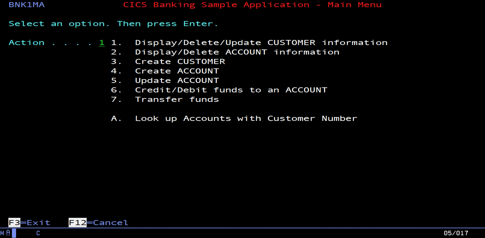
>
>
> This gives:
>
> 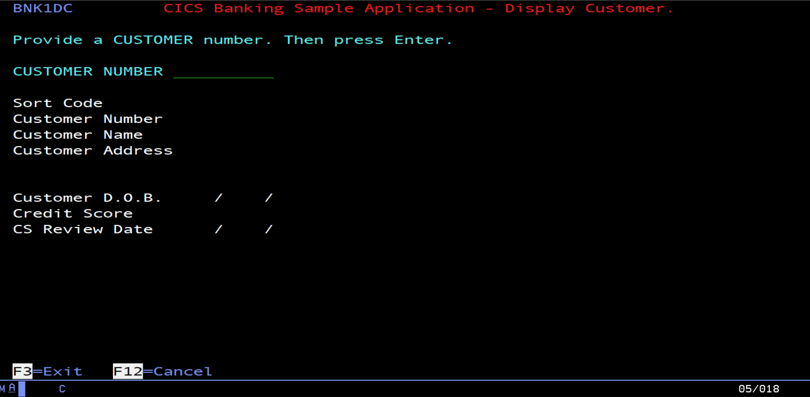
>
> and then enter a customer number e.g. 1234:
>
> 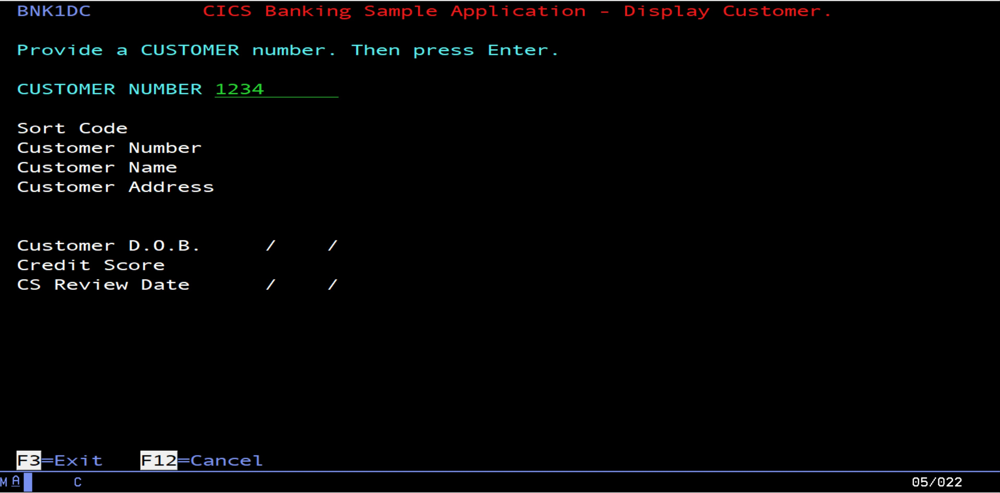
>
>
> And the details for that customer will be returned:
>
> 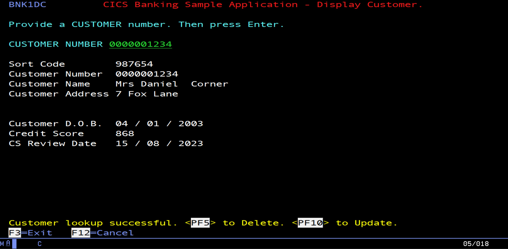
>
>
> Notice further options are displayed at the bottom of the screen. In
> this case, how to exit the screen (f3), how to Update the Customer
> details (f10) or how to Delete the Customer (f5).

#### Displaying Account information (option 2 from the main menu):

####  

> There are lots of prepopulated accounts belonging to customers. To
> display details of a single account, select option 2 (from the main
> menu):
>
> 
>
>
> This gives:
>
> 
>
> and then enter an account number:
>
> 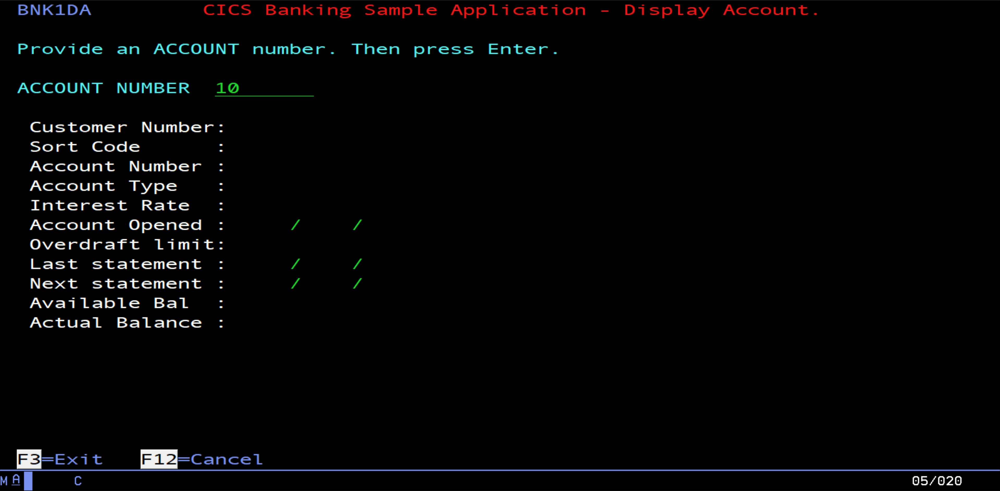
>
>
> This returns:
>
> 
>
>
> As before, further options are displayed at the bottom of the screen.

#### Displaying All of the Accounts for a given Customer (option A from the main menu):

####  

> To see what accounts a particular Customer has select option A from
> the main menu:
>
> 
>
> and provide the Customer number:
>
> 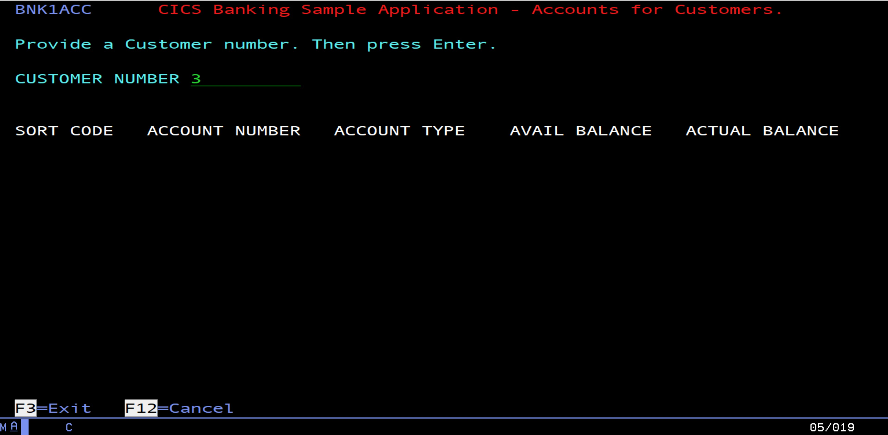
>
>
> 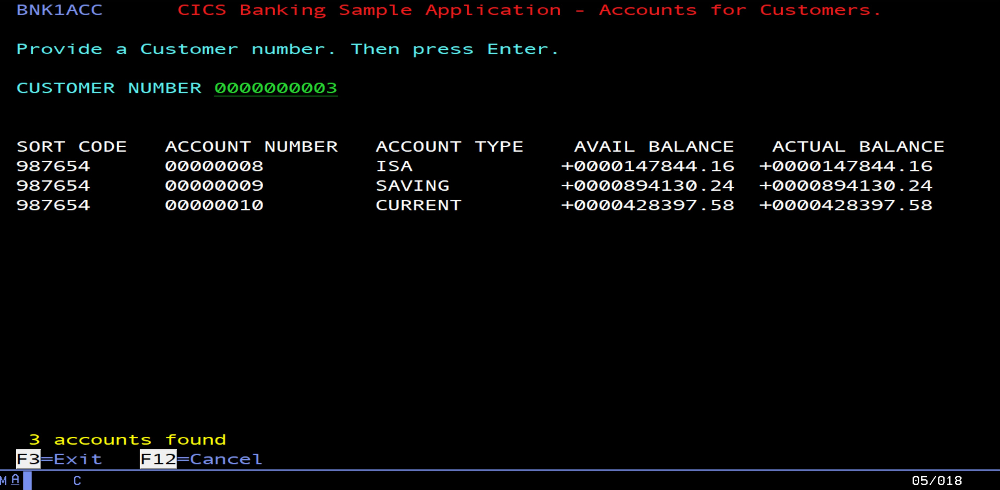
>
>
> In this example Customer 3 has 3 accounts (ISA, SAVING, CURRENT) which
> all hold different balances.

## 

#### Creating a New Customer (option 3 from the main menu):

####  

> To create a new Customer, select option 3 from the main menu:
>
> 
>
>
>
> This gives:
>
> 
>
> Then supply the required information:
>
> 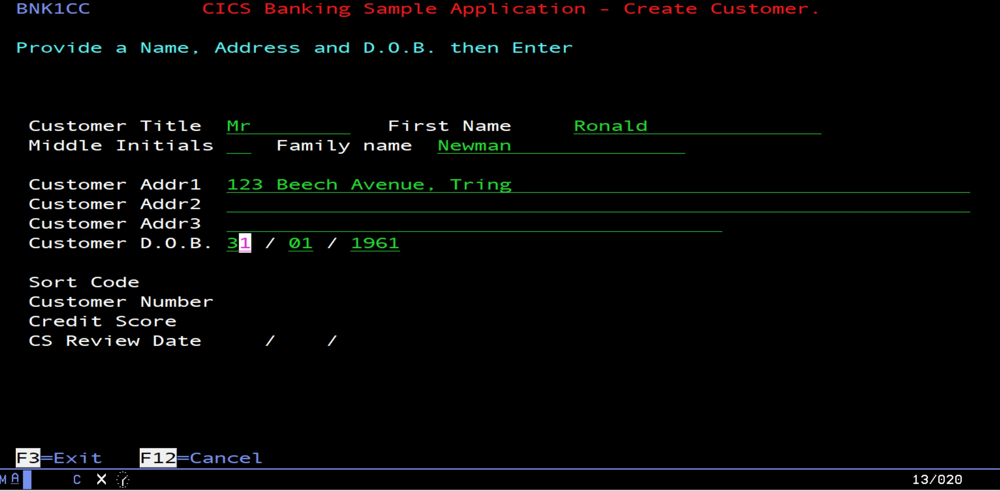
>
>
> Validation will guide you through what content is acceptable or not,
> on a field-by-field basis.
>
> Once the information provided has passed the validation check a new
> Customer Number, Sort Code and Credit Score will be returned.
>
> 
>

#### Creating a New Account (option 4 from the main menu):

####  

> To create a new Account, select option 4 from the main menu:
>
> 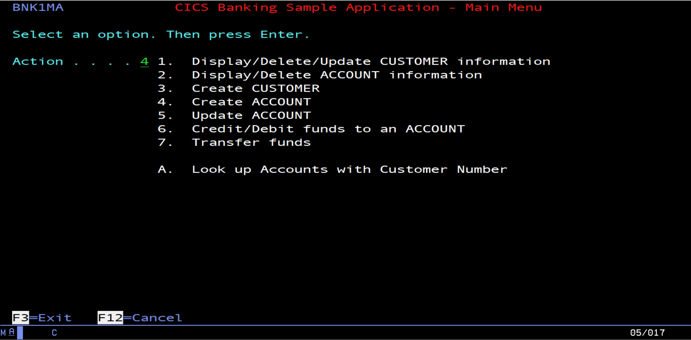
>
>
> 
>
>
> Assign a Customer Number that the new Account relates to, an Account
> Type which can be MORTGAGE, SAVINGS, ISA, LOAN or CURRENT. Enter an
> interest rate that is applicable to that account, and any overdraft
> amount applicable to that account (in whole pounds) and hit enter.
>
> The details get validated, with suitable messages returned if a field
> needs to be modified. In the example below, the Account Type has not
> been supplied, resulting in an appropriate error message:
>
> 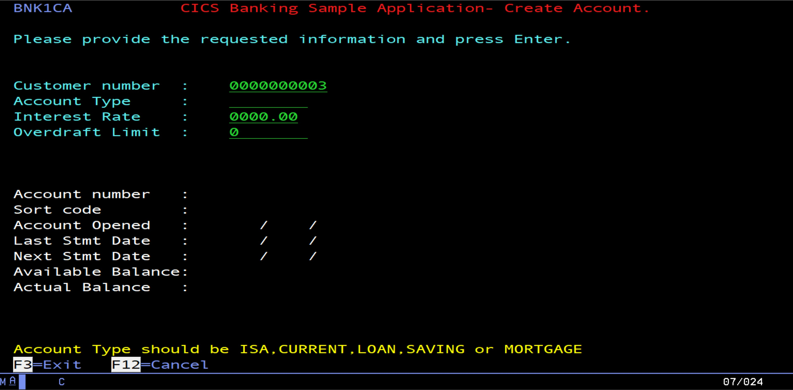
>
>
> Once the details pass validation, information about the new account is
> returned (e.g. the allocated Account number, etc.):
>
> 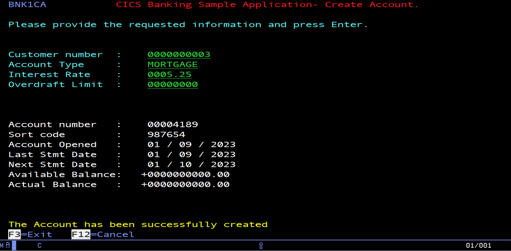
>
#### Update Account Information (option 5 from the main menu):

####  

> To update the details of an existing Account, select option 5 from the
> main menu:
>
> 
>

> 
>
>
> and provide the account number:
>
> 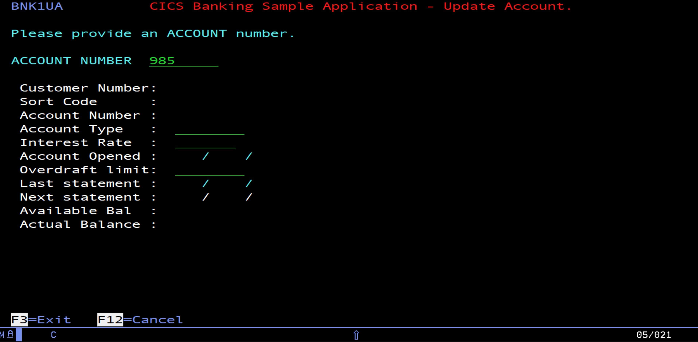
>
>
> This displays the account details:
>
> 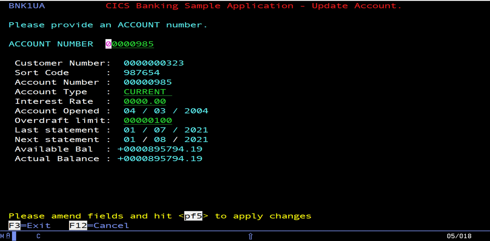
>
>
> In this case the Account Type, the Interest Rate and the Overdraft
> Limit are the 3 fields which may be amended:
>
> 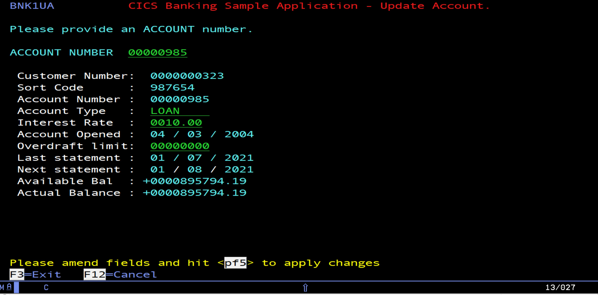
>
>
> This example amends the Account Type and Interest Rate, then simply
> press pf5 to apply the changes:
>
> 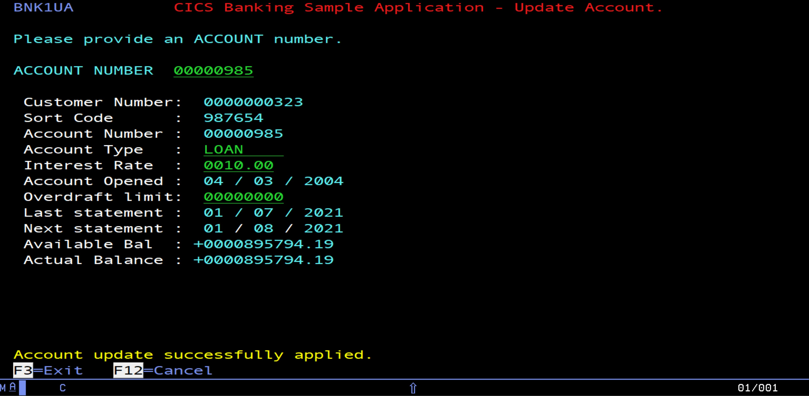
>

#### Credit and Debit funds to an Account (option 6 from the main menu):

####  

> To credit (pay in) or debit (withdraw) funds from an Account, use
> option 6 from the main menu:
>
> 
>
>
> 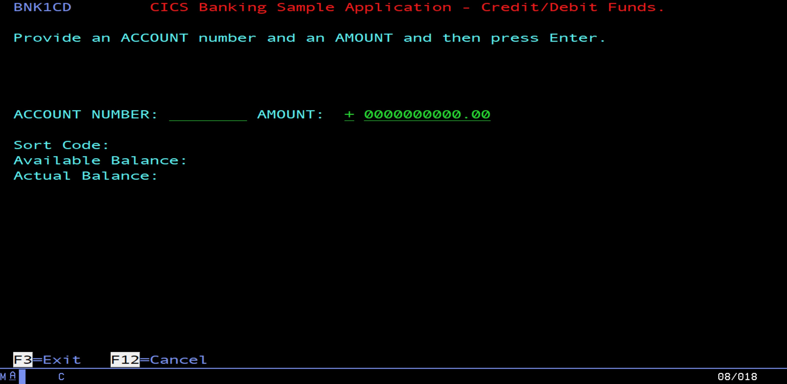
>
>
> and provide the account number and either + (for credit) or - (for
> debit) followed by the amount:
>
> 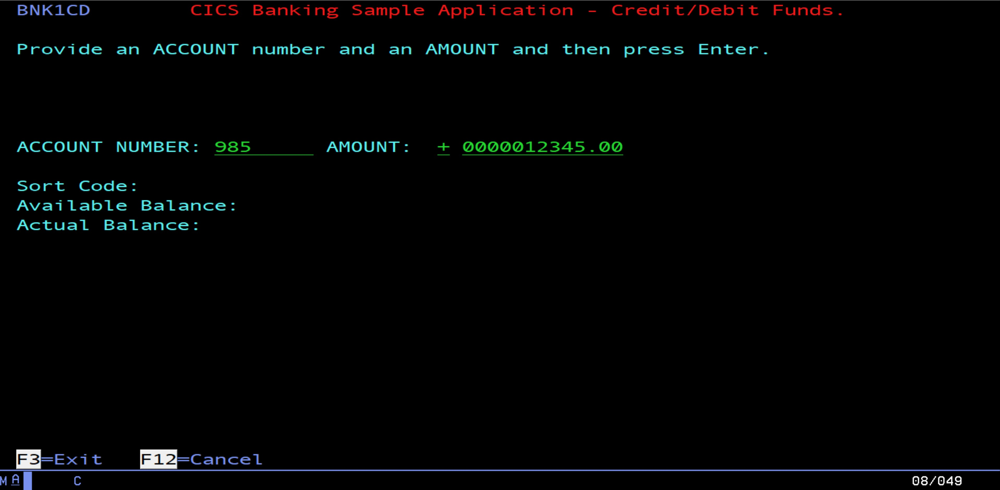
>
>
> Then press enter:
>
> 
>

#### Transfer funds between Accounts (option 7 from the main menu):

####  

> To transfer funds between accounts, use option 7 from the main menu:
>
> 
>
> 
>
>
> The transfer can be for accounts held by the same or different
> customers. Simply enter the FROM account number, the TO account number
> and the amount you wish to transfer:
>
> 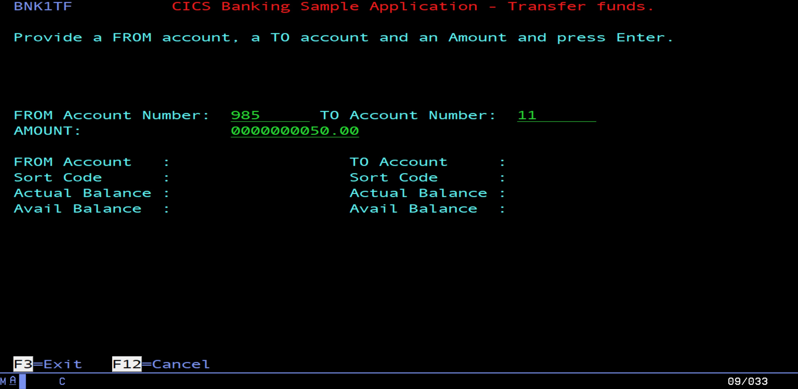
>
>
> Then press enter:
>
> 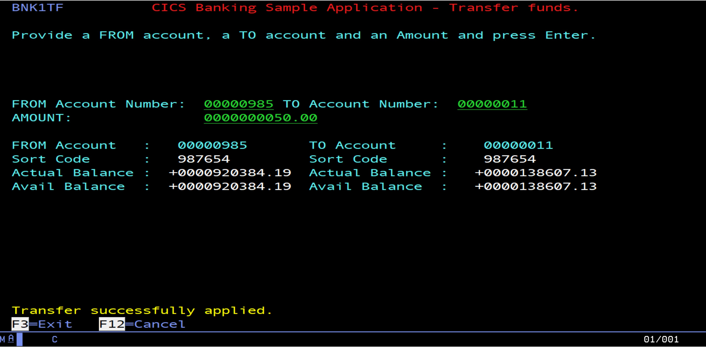
>
>
> Upon a successful transfer the balances of the FROM and TO accounts
> will be shown.

All successfully enacted transactions are updated in real time, and
details of all successful transactions (apart from Account and Customer
inquiries) are recorded on the PROCTRAN table (PROCTRAN=Details of
successfully processed transactions).

## Source code:

All source code, BMS maps and copy libraries can be found in the GitHub
repo:

[BMS](/src/base/bms_src/)

[COBOL](/src/base/cobol_src/)

[Copybooks](/src/base/cobol_copy/)

