# CICS Bank Sample Application (CBSA) React UI User Guide 

## CICS Bank Sample Application React UI Architecture:

For architecture information please refer to the GitHub repo: 

cicsdev/cics-banking-sample-application-cbsa/doc ([here](../../../../doc/CBSA_Architecture_guide.md))

## Accessing the React UI:

Access to the React UI is via a web browser. The exact URL will depend
upon the host name and the port number chosen during installation. It
will look something like this:

[http://*your-allocated-host-name*:*your-port-number*/webui-1.0/](http://your-allocated-host-name:your-port-number/webui-1.0/)

#### CICS Bank Sample Application Main Menu:

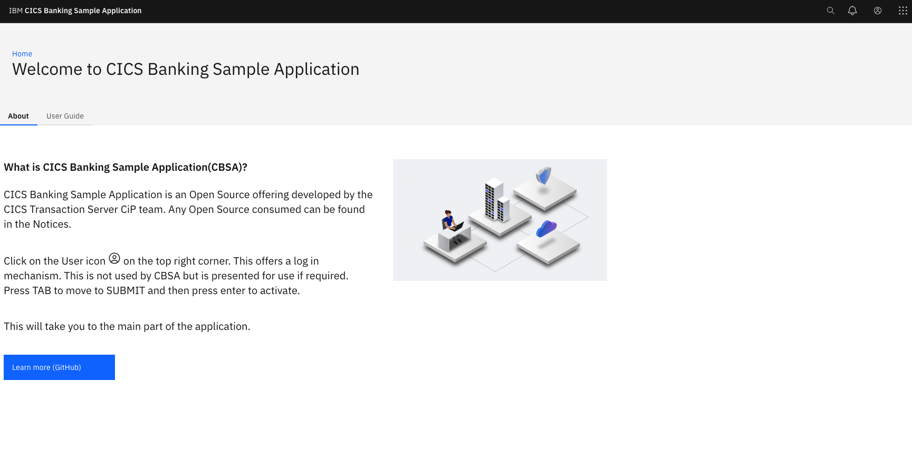

The React UI main menu is the start point for utilising all
functionality from this interface. The React UI contains similar
functionality to the BMS offering, however it should be noted that there
is not a 1-1 mapping. 

The React UI contains some functionality which
the BMS offering does not. To utilise a specific function click on the
associated button.

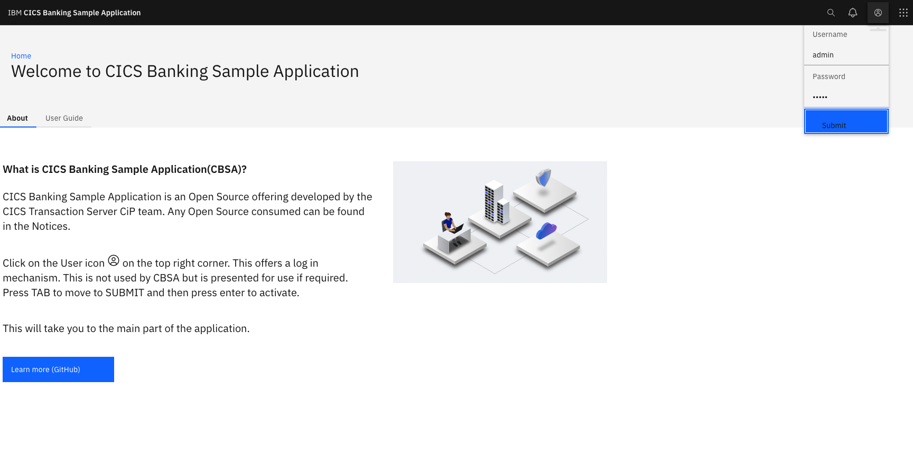

CBSA has a login mechanism, which is yet to be implemented with any actual security. Any combination of userid and password will take you through to the control panel.

#### Control Panel

Upon login, the user will see the user functions list, containing both "User Services" and "Accounts Service". These functions are also available from the hamburger menu in the top left of the screen. 

#### Create a New Customer

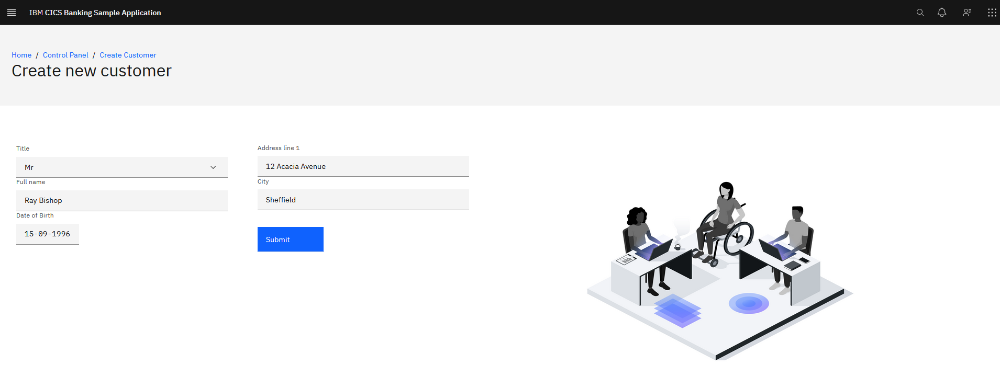

A new customer can be created using this view. Note, the expected field format should be present in the boxes before completion. E.g Date of birth should be `dd-mm-yyyy`. If any field is completed incorrectly the account will not be created.

Clicking submit once the form is completed will generate the popup:

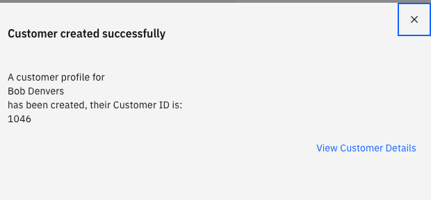

The customer ID is generated upon creation. 

**Note**: Customers cannot be younger than 18 or older than 120.

#### View / Update Customer Details

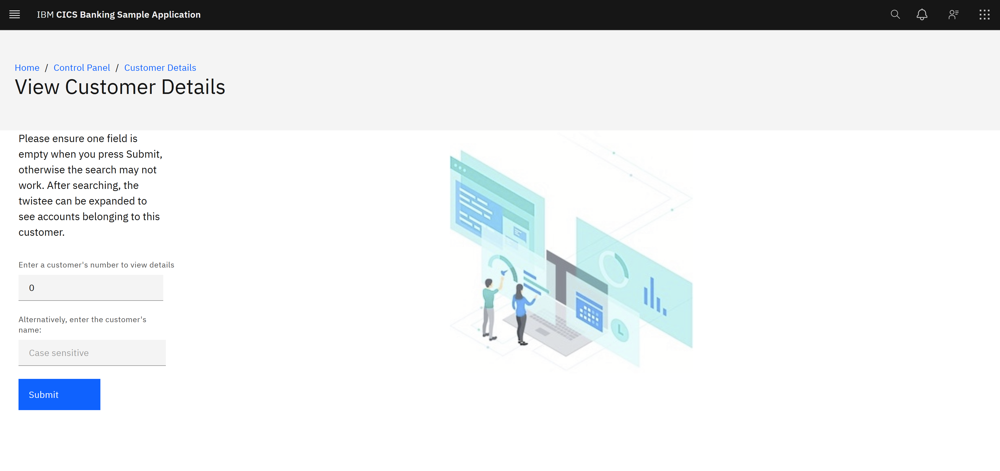

A customer can be viewed using the CustomerId number or using the customer name. Once the submit button is pushed the customer table will appear if the customer exists. The twistie can be expanded to view the customer's accounts.

Click the update button to produce the update popup:

Using the submit button will save any edits to a customer's details. The page will then reload and you will need to enter the customer's number again to view the amended record.

#### Adding an account:

Customers are limited to a maximum of TEN accounts.

From the Control Panel:

Click "Create a New Account":

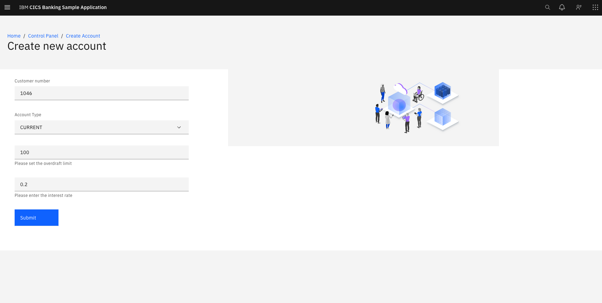

You MUST specify the customer number of the customer to whom the account
belongs. You can:

-   change the account type using the drop down list.

-   change the overdraft limit and the interest rate which have the same
    restrictions as before.

Click "Submit" to create the account:

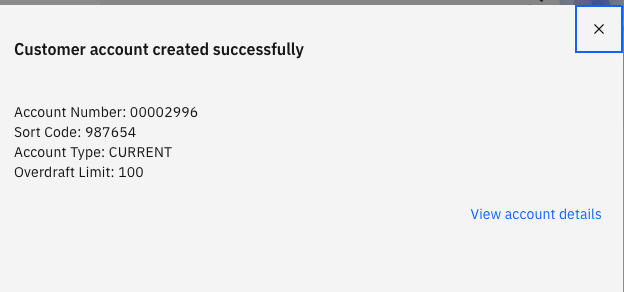

If the account creation was successful, the text within the button gets
amended with the account number which was allocated, in this case
account 00002996.

**Note**: One customer may only open 10 accounts. Opening more will result in failure to open an account.

#### Viewing an Account

From the Control Panel:

Click "View/Update Account details":

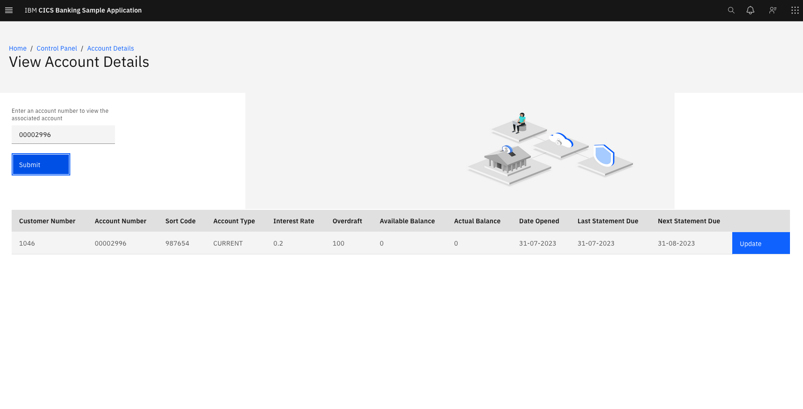

Entering the account number and clicking "Submit" will produce a table containing the account.

The account can then be updated using the "Update" button on the account

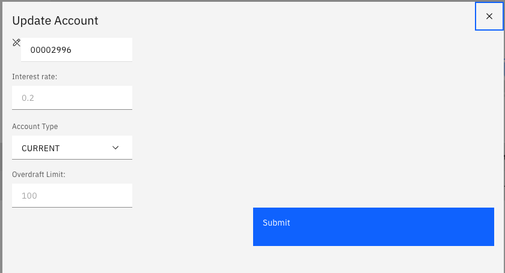

After clicking submit, the page will then reload and you will need to enter the account number again to view the amended record.

#### Delete an Account

From the Control Panel:

Click "Deleting existing account":

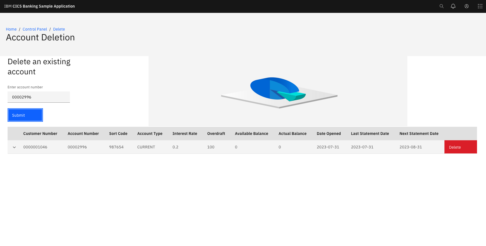

Searching for the account using the account number and clicking "Submit" will show the existing account in a table. Clicking the "Delete" button will produce a warning popup.

Clicking "Delete" again will permanently remove the account.

#### Deleting a Customer

From the Control Panel:

Click "Deleting existing customer":

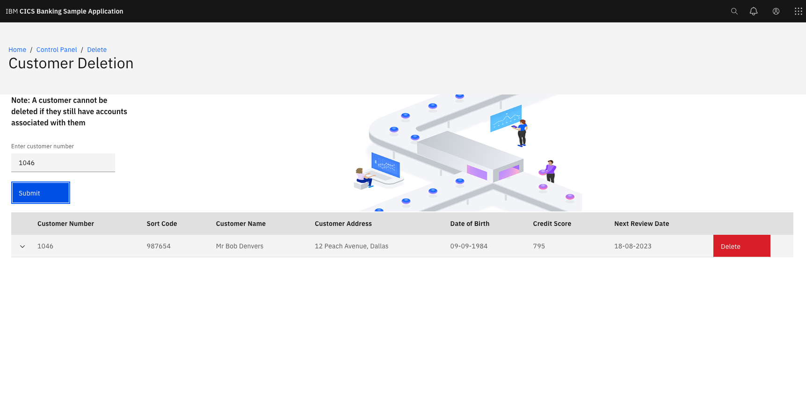

Searching for the customer using the customer number and clicking "Submit" will show any existing customer in a table. Clicking the "Delete" button will produce a warning popup.

Clicking "Delete" again will permanently remove the customer.

**Note**: You cannot delete an existing customer if they have any open accounts.
