# The Customer Services Interface User Guide

### 

### Introduction:

The Customer Services interface is a Spring Boot application, which can
drive back-end banking data, via a series of RESTful API calls, made to
a zOS Connect server, which in turn, routes the requests to the CICS
region. Please refer to [CBSA RESTful API guide](CBSA_Restful_API_guide.md).

### The business justification/usage scenario for the Customer Services interface:

The CBSA Customer Services interface will be used, in branch, to reduce
people's queueing time. Staff will be deployed as "queue busters" at peak
times. They will be armed with a tablet, and they will walk the queue
and perform some of the functions of the Teller. The bank doesn't want
the queue busters to become a target for robbery, so the tasks that they
can perform (via the Customer Services interface) are more
administrative in nature. For handling money (paying it in, taking it
out, transferring it or dealing with cheques) the customer will still
need to see a CBSA Bank Teller who will utilise the BMS or Carbon React UI
interface to perform those functions.

Further information about the Teller's interfaces can be found in the
[BMS User Guide](/etc/usage/base/doc/CBSA_BMS_User_Guide.md) and the [Carbon React UI User Guide](/etc/usage/carbonReactUI/doc/CBSA_Carbon_React_UI_User_Guide.md)

Queue busters can attend to things like:

-   Account or customer enquiries

-   Updating customer details (e.g. changes of address, or name changes)

-   The creating of new customers

-   Deleting a customer (when a customer leaves or dies)

-   Updating account details (increasing overdraft limits etc.)

-   The opening of new accounts

-   Account deletion (if the customer wants to close any of their
    accounts)

The RESTful API can be utilised directly without using the Customer
Services interface and could, if required, be integrated with other
applications. The Customer Services interface has been provided, along
with the source code etc. to allow the RESTful API to be used straight
from the box.

The functionality in this interface, mimics most functions provided in
the BMS and Carbon React UI interfaces (as used by the Teller).

### Accessing the Customer Services Interface:

It can be accessed via a URL structured as follows:\
\
[http://your-host-name:your-host-port-number/customerservices-1.0/](http://your-host-name:your-host-port-number/customerservices-1.0/)

(\* as part of the installation process, you will have previously assigned your own hostname and port number for the Customer Services interface to utilise).

### The Customer Services landing page:

The landing page is the start point for accessing all of the Customer
Service functionality. To initiate each function simply click on its
associated blue function button.

### *Create a Customer:*

Accounts may only exist if they belong to an associated customer. To
create a new customer, click on the "Create customer" button on the
landing page.

Next, provide a Customer Name (which is comprised of a title, first
name, middle initial, and surname), and the Customer's Address and their
Date of Birth (in DD/MM/YYYY format).

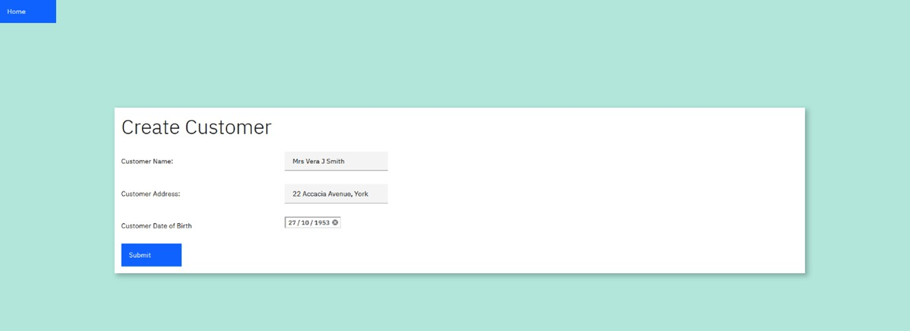

Once you are happy, click on the "Submit" button.

Under the covers, validation will be carried out. Should something fail
a validation check, you will be prompted to correct any invalid data and
resubmit.\
\
\
Once the details have been validated, a RESTful API call gets executed
which initiates a call to one of CBSA's existing back-end programs, to
create the customer information. Assuming that the call was successful,
confirmation will be returned:

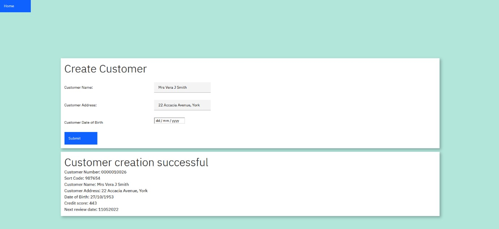

(If for some reason a call was unsuccessful, a suitable error reply will
be returned).

Upon completion of creating a new customer, simply press "Home" to
return to the landing page.

### *Customer Enquiry:*

To see customer details click the "View customer details" button on the
landing page:

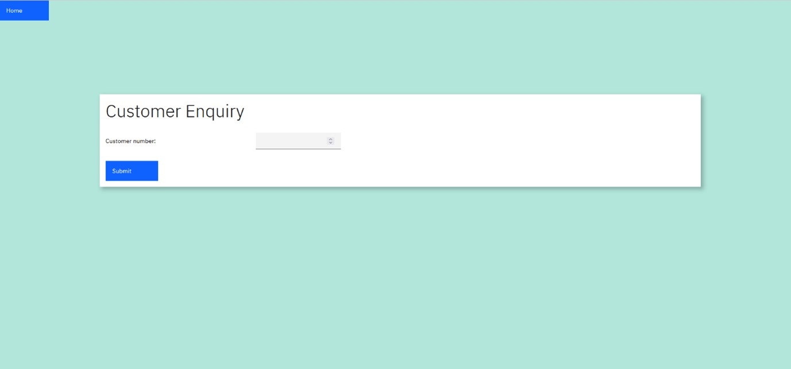

Enter a customer number:

and click "Submit":

And the Customer details will be returned (see above).

### *Update a Customer:*

To amend customer details click the "Update customer details" button on
the landing page:

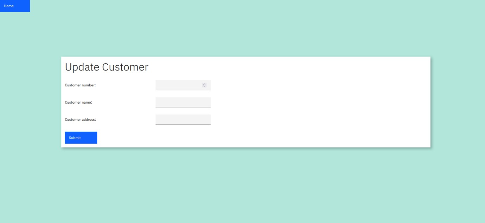

Supply the customer number, and an amended customer name (to perform a
name change):

And press "Submit"

Or another valid combination might be to amend the customer's address.
Again, supply the customer number and the amended address details:

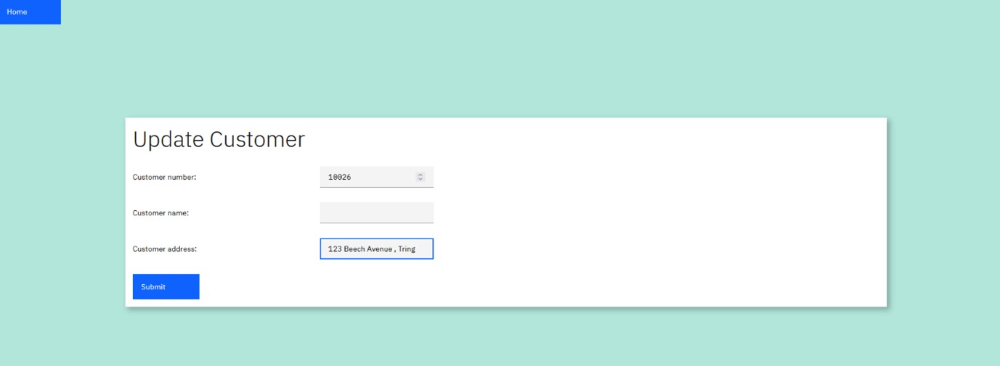

And click Submit:

Or the name and address can be updated at the same time, by providing
the customer number, and an amended name and an amended address all
together:

And click Submit:

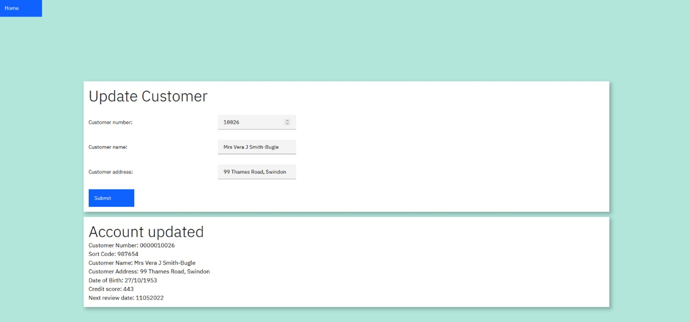

The change/changes should be acknowledged (as shown above).

Clicking "Home" returns back to the landing page.

### *List Accounts belonging to a Customer:*

To display the accounts for a particular customer, click on "List
accounts belonging to customer":

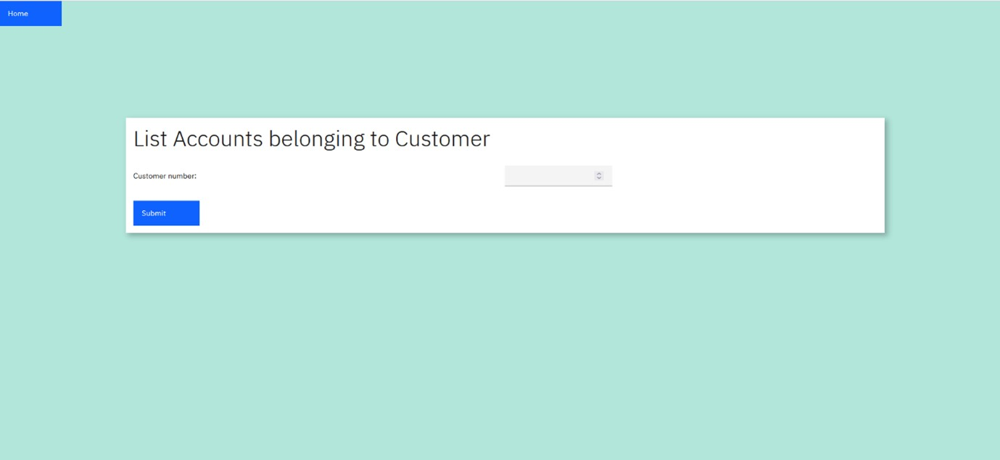

Supply a Customer number:

And click "Submit":

And the associated accounts will be returned. In this example, Customer
2345 has two accounts (7012 and 7013) associated with it .

Click "Home" to return to the landing page.

### *Customer removal/deletion:*

To remove a customer, click on "Delete customer" from the landing page:

Supply the customer number:

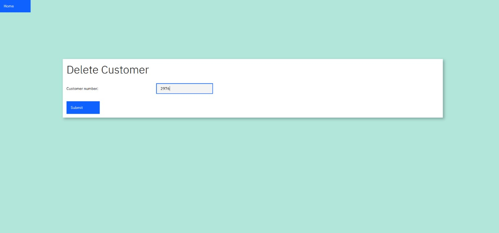

And then click "Submit":

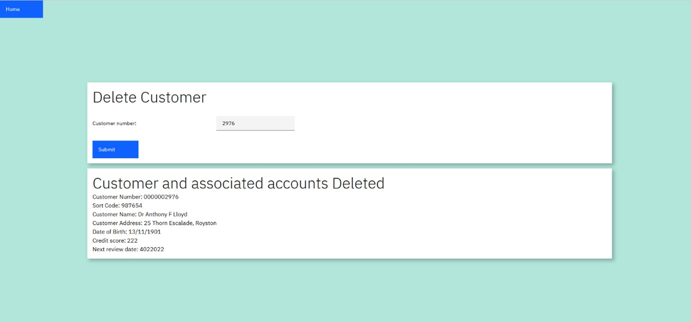

If the request to delete the customer was successful, you should get a
confirmation message (shown above). **NOTE** Deleting a customer also
removes all associated accounts for that customer.

Click "Home" to return to the landing page.

### *Account creation:*

To create a new account for a Customer, click on "Create account":

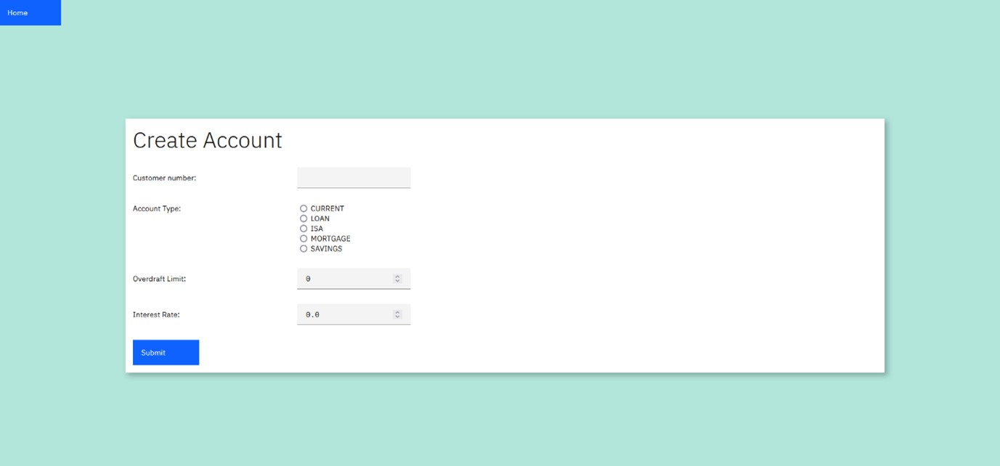

Supply the customer number, and select a type of account from the radio
buttons provided, and set the Overdraft limit and Interest rate (if
applicable):

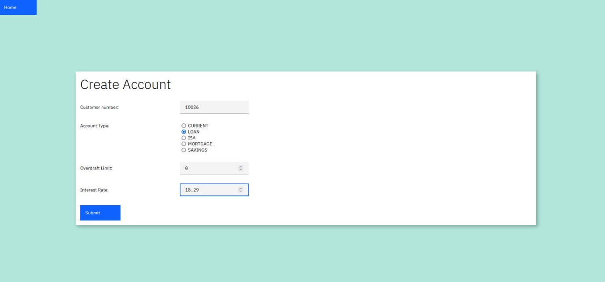

Then click Submit:

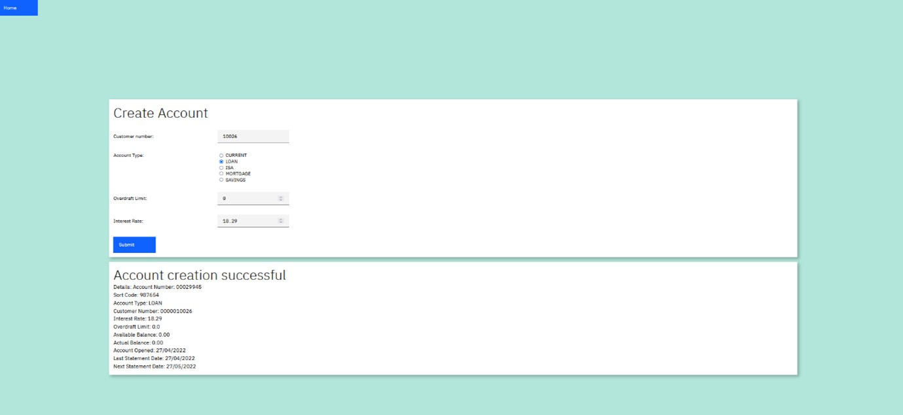

Associated details belonging to the new account get returned upon
successful completion (see above).

To return to the landing page click "Home".

### *Account enquiries:*

To enquire on an account, click on "View account details" from the
landing page:

Supply an account number:

Then click "Submit":

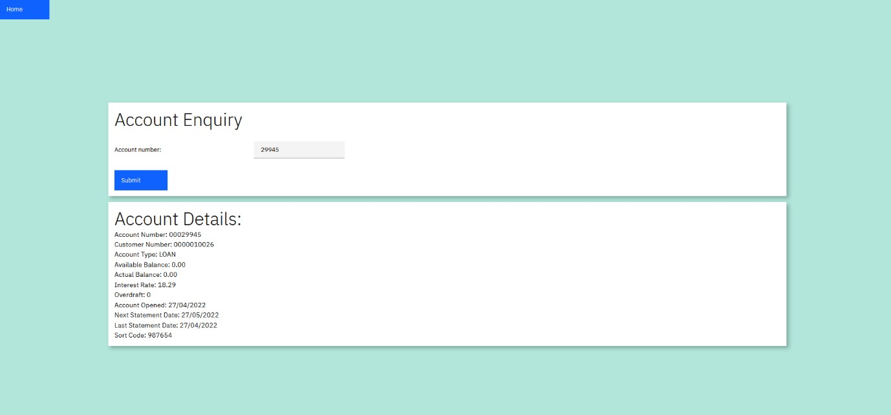

The account information data is returned (as shown above).

To return to the landing page click "Home".

### *Update Account information:*

To amend account information, click on "Update account details" from the
landing page:

Supply the account number that you wish to update, then you have the
option to amend the account type (for example to turn a loan account
into a mortgage account), along with updating the interest rate and
overdraft limit. You have the choice of changing the account type,
interest rate or overdraft limit individually or you can change any
combination together:

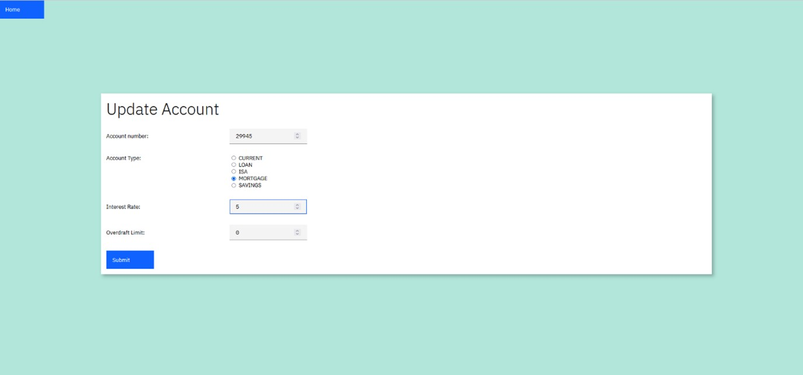

(in this example we change the account type and interest rate)

Click "Submit":

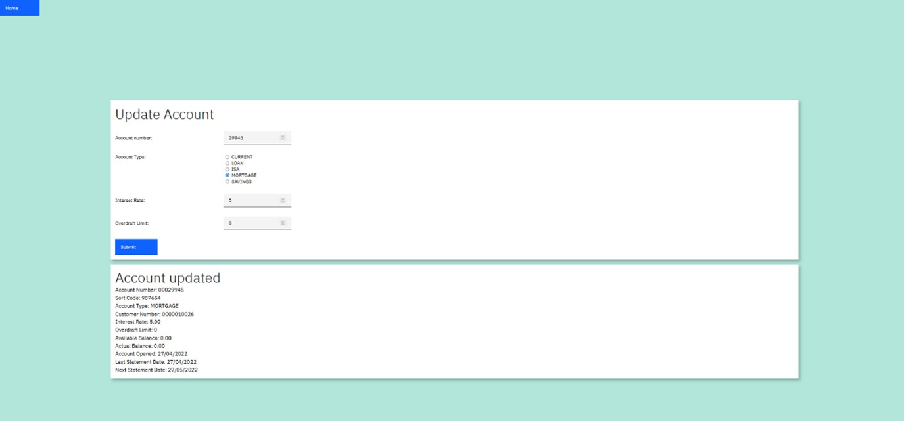

Confirmation of the change is provided upon successful completion.

To return to the landing page, click "Home".

### *Account Deletion:*

To remove an account click on "Delete account" from the landing page:

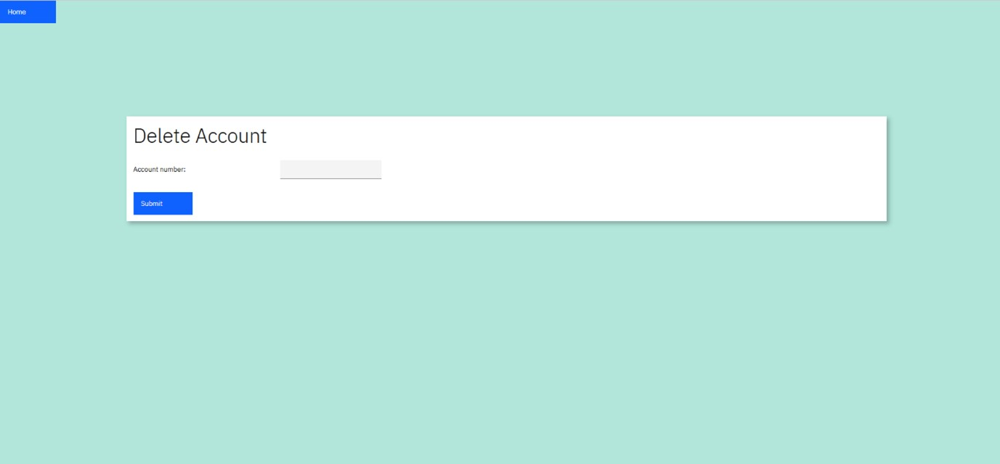

Provide an account number:

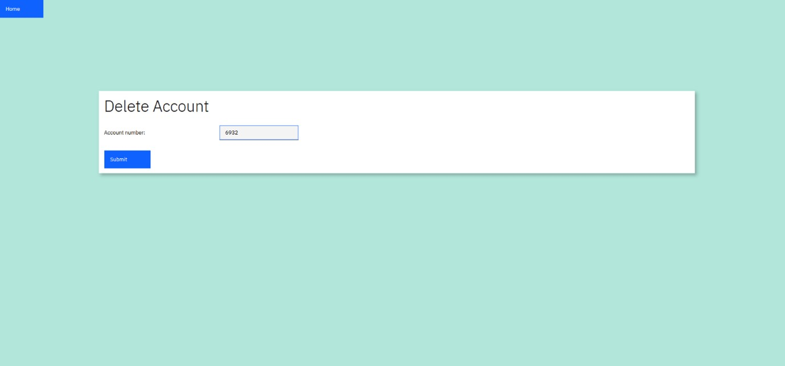

And click "Submit":

Acknowledgement that the deletion has been successful is provided (see
above).

To return to the landing page click "Home".
